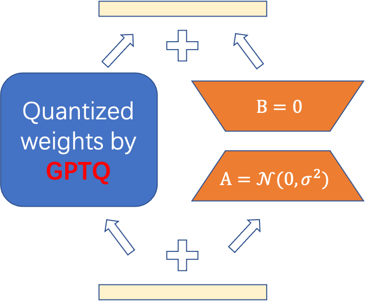

# Do Emergent Abilities Exist in Quantized Large Language Models: An Empirical Study

This is the implementation of the [paper](https://arxiv.org/abs/2307.08072):
> Peiyu Liu, Zikang Liu, Ze-Feng Gao, Dawei Gao, Wayne Xin Zhao, Yaliang Li, Bolin Ding, Ji-Rong Wen. Do Emergent Abilities Exist in Quantized Large Language Models: An Empirical Study
*Updates*:

* [July 22] We update support for [LLaMA-2](https://ai.meta.com/research/publications/llama-2-open-foundation-and-fine-tuned-chat-models/) fine-tuning.
* [July 15] We release the code especially for fine-tuning LLaMA-65B within a single A100 GPU.

---
## Abstract
We aim to investigate the impact of quantization on emergent abilities, which are important characteristics that distinguish LLMs from small language models. Specially, we examine the abilities of in-context learning, chain-of-thought reasoning, and instruction-following in quantized LLMs. Our empirical experiments show that these emergent abilities still exist in 4-bit quantization models, while 2-bit models encounter severe performance degradation on the test of these abilities. To improve the performance of low-bit models, we conduct two special experiments: (1) fine-gained impact analysis that studies which components (or substructures) are more sensitive to quantization, and
(2) performance compensation through model fine-tuning. Our work derives a series of important findings to understand the impact of quantization on emergent abilities, and sheds lights on the possibilities of extremely low-bit quantization for LLMs.

## Requirements

Install dependencies
```bash
pip install -r requirements.txt
cd peft/
pip install -e .
```

## Quick Start
## 1.Fine-tuning before quantization
For LoRA, change the `lora_r` by setting `lora_r={8,16,64}` for more trainable parameters. 
### LoRA
```bash
finetune_multi alpaca_lora $data_dir/alpaca_data_cleaned.json --adapter_name=lora\ --base_model=decapoda-research/llama-7b-hf\ --learning_rate=7e-5\ --use_gradient_checkpointing
```

## 2.Fine-tuning after quantization
With the help of [GPTQ-for-LLaMa](https://github.com/qwopqwop200/GPTQ-for-LLaMa), we can easily quantize 65B LLaMA into 2/4/8 bit precision.
<div style="text-align: center;">

</div>

### GPTQ-LoRA
- step 1: quantize the LLMs into low-bit precision. More details can refer to [GPTQ-for-LLaMa](https://github.com/qwopqwop200/GPTQ-for-LLaMa).
```bash
CUDA_VISIBLE_DEVICES=1 python $base_dir/llama.py /mnt/data/pyliu/llama-65b-hf c4 --wbits 2 --true-sequential --act-order --groupsize 128 --save $out_dir/llama65b-2bit.pt $4
```
- step 2: post process the weights save to file:"$checkpoint/llama-65b-2bit-formulate" 
```python
state_dict = torch.load(quant_checkpoint, map_location="cpu")
new_state_dict = {}
for k,v in state_dict.items():
    new_state_dict["base_model.model." + k] = v
torch.save(new_state_dict, "llama-65b-2bit-formulate")
```
- step 2: bash run.sh.
```bash
finetune_multi alpaca_gptqlora_65B_2bit $base_dir/alpaca_data_cleaned.json --adapter_name=gptqlora\ --target_modules="['q_proj','k_proj','v_proj','o_proj','up_proj','gate_proj','down_proj']"\ --base_model=$checkpoint/llama-65b-hf\ --quant_checkpoint="$checkpoint/llama-65b-2bit-formulate"\ --use_gradient_checkpointing\ --bits=2
```
# Resource Consumption
We present a table of resouce needed for fine-tuning on quantized model weights, which contains Trainable Parameters, GPU RAM Usage, and Fine-tuning Time on the alpaca dataset.

Hyperparameters: 
```bash
--batch_size 16
--micro_batch_size 2
--num_epochs 3
--learning_rate 3e-4
--target_modules "['q_proj','k_proj','v_proj','o_proj','up_proj','gate_proj','down_proj']"
```

Hardware: 2*A100 GPUs

| Model                 | Bits   |Trainable Parameters  | GPU RAM Usage | Fine-tuning Time |
|-----------------------|--------|----------------------|---------------|------------------|
| LLaMA-7B-GPTQLoRA     | 2      | 20.0M                | 2.2GB         |     ~3h          | 
| LLaMA-7B-GPTQLoRA     | 4      | 20.0M                | 3.8GB         |     ~3h          | 
| LLaMA-13B-GPTQLoRA    | 2      | 31.3M                | 3.9GB         |     ~6h          | 
| LLaMA-13B-GPTQLoRA    | 4      | 31.3M                | 7.0GB         |     ~6h          | 
| LLaMA-65B-GPTQLoRA    | 2      | 99.9M                | 17.8GB        |     ~24h         | 
| LLaMA-65B-GPTQLoRA    | 4      | 99.9M                | 32.7GB        |     ~24h         | 
| LLaMA-2-70B-GPTQLoRA  | 2      | 103.5M               | 18.5GB        |     ~24h         | 
| LLaMA-2-70B-GPTQLoRA  | 4      | 103.5M               | 34.5GB       |     ~24h         | 

# Acknowledgements
Thankes to the powerful PTQ project [GPTQ-for-LLaMa](https://github.com/qwopqwop200/GPTQ-for-LLaMa).

Thanks Meta AI for releasing LLaMA models.